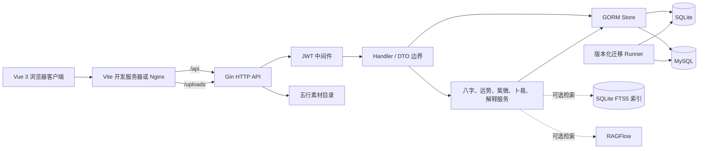

# bazi

`bazi` 是一个以 Go 和 Vue 3 构建的命理 Web 应用，覆盖八字排盘、日/周/月运势、紫微斗数、卜易、历史记录、解释反馈和可选的本地/RAGFlow 检索增强解释。

项目同时支持两种持久化后端：本地开发默认使用 SQLite；设置 `DB_HOST` 后切换为 MySQL。前端通过统一的 `/api` 客户端访问 Gin API，生产容器由 Nginx 提供静态页面并代理 API 与上传资源。

> [!IMPORTANT]
> 本项目展示的是传统规则的确定性计算、结构化索引和解释材料。用户可见的规则、评分、证据标签与文案不代表现实结果、发生概率或决策建议。代码中的 `not_validated`、`not_adjudicated`、`is_outcome_conclusion=false` 等边界属于产品合同，不应在下游弱化。

## 目录

- [主要能力](#主要能力)
- [系统架构](#系统架构)
- [技术栈](#技术栈)
- [仓库结构](#仓库结构)
- [快速开始：SQLite](#快速开始sqlite)
- [使用 Docker Compose](#使用-docker-compose)
- [使用 MySQL](#使用-mysql)
- [配置参考](#配置参考)
- [数据库与迁移](#数据库与迁移)
- [API 概览](#api-概览)
- [前端结构](#前端结构)
- [认证与安全边界](#认证与安全边界)
- [RAG 与解释服务](#rag-与解释服务)
- [五行素材](#五行素材)
- [测试与质量门禁](#测试与质量门禁)
- [CI](#ci)
- [开发与变更约束](#开发与变更约束)
- [常见问题](#常见问题)
- [部署检查清单](#部署检查清单)
- [相关文档](#相关文档)

## 主要能力

### 账户与命盘

- 用户注册、登录和当前用户查询。
- 使用公历或农历出生信息创建八字命盘。
- 预览可能跨排盘边界的出生时间区间，并由用户选择候选命盘。
- 保存和查询用户自己的历史命盘。
- 支持时区、真太阳时、经度、闰月与 UTC 偏移等输入合同。

### 八字与运势

- 四柱、十神、藏干、纳音、十二长生、神煞和五行结构展示。
- 日运、周运、月运及对应趋势与证据明细。
- 将评分明确表示为传统规则关系形成的结构化索引，而不是现实结果概率。
- 支持基础、进阶和专业解释层级，并保留规则版本、来源和验证状态。
- 保存运势历史，并提供祈福视图等前端使用场景。

### 紫微斗数

- 十二宫、主星/辅星、四化、三方四正与长生十二神等结构化输出。
- 大限、流年、流月、流日、四化飞星、四化链、自化和宫位解读。
- 支持本命盘缓存、派生盘输入指纹、内容哈希和规则版本元数据。
- 提供面向前端查询的 `query_view`，统一星曜索引和宫位关系。

### 其他能力

- 每日卜易结果，并按用户和上海自然日持久化。
- 用户对解释质量提交反馈，反馈只描述解释质量，不收集现实结果验证。
- 五行素材选择与管理员上传。
- 可选的本地 SQLite FTS5 或 RAGFlow 解释检索。
- 规则精度、外部银标、固定 Gold fixture 和来源边界检查。

## 系统架构



请求处理遵循以下边界：

1. Vue 页面通过 `vue/src/api/client.ts` 发送 `/api` 请求。
2. Vite 开发服务器或 Nginx 将 `/api` 和 `/uploads` 转发给后端。
3. Gin 在公共认证路由之外统一验证 Bearer JWT。
4. Handler 负责 HTTP 输入、身份范围、DTO 和错误码，不承载领域算法。
5. Service 负责确定性的命理计算与解释组装。
6. Store 负责用户范围内的持久化查询。
7. 应用启动时由 `src/migrations/runner.go` 先迁移数据库，再注册服务和路由。

## 技术栈

### 后端

- Go，版本要求以 [`src/go.mod`](src/go.mod) 为准。
- Gin：HTTP 路由和中间件。
- GORM：SQLite/MySQL 持久化。
- `tyme4go`：历法基础能力。
- `golang-jwt/jwt`：HS256 Bearer JWT。
- `bcrypt`：用户密码哈希。

### 前端

- Vue 3、TypeScript、Vite。
- Vue Router 和 Pinia。
- Axios API 客户端。
- Element Plus、shadcn-vue、Reka UI。
- Tailwind CSS。
- ECharts / vue-echarts、Cobe 和 Paper Design Shaders。
- Vitest、Vue Test Utils、ESLint 和 `vue-tsc`。

### 运行与交付

- Docker 多阶段构建。
- Nginx 静态站点与反向代理。
- Docker Compose 编排 MySQL、后端和前端。
- GitHub Actions 执行聚焦 Go、Vue 和仓库治理检查。

## 仓库结构

```text
bazi/
├── .github/workflows/       # 聚焦 CI 与治理检查
├── data/                    # 仓库级素材、外部数据和本地 RAG 索引默认位置
├── docs/                    # 测试政策、ADR 与维护文档
│   └── adr/                 # 按状态和类别组织的架构决策记录
├── library/                 # 只读命理参考材料，不作为可直接改写的业务代码
├── research/                # 研究清单、来源目录和可审计中间材料
├── scripts/                 # 治理、Docker、索引、生成、抓取和 E2E 工具
├── src/                     # Go module
│   ├── cmd/                 # API 组合根与辅助命令
│   ├── data/                # 本地后端运行数据目录
│   ├── internal/
│   │   ├── config/          # 环境变量配置
│   │   ├── handler/         # HTTP 路由、请求验证和响应 DTO
│   │   ├── middleware/      # JWT、ETag 等中间件
│   │   ├── model/           # GORM 模型和跨层数据结构
│   │   ├── service/         # 领域算法、解释、精度和 RAG
│   │   └── store/           # 数据库访问实现
│   └── migrations/          # 版本化数据库迁移唯一入口
└── vue/                     # Vue 3 前端
    ├── src/api/             # 后端 DTO 与 API 客户端
    ├── src/components/      # 可复用界面组件
    ├── src/composables/     # 组合式逻辑
    ├── src/lib/             # 展示解释和领域文案辅助函数
    ├── src/router/          # 页面路由与登录守卫
    ├── src/stores/          # Pinia 状态
    └── src/views/           # 页面级视图
```

多个子目录包含 `AGENTS.md`，用于声明该子树的所有权、局部不变量和最小验证范围。修改文件前应先读取路径上最近的 `AGENTS.md`。

## 快速开始：SQLite

SQLite 是本地开发默认后端。只要 `DB_HOST` 为空，后端就会使用 `SQLITE_PATH`。

### 1. 准备依赖

需要：

- `src/go.mod` 要求的 Go 工具链。
- Node.js 与 npm；容器构建使用的 Node 主版本可在 [`vue/Dockerfile`](vue/Dockerfile) 查看。
- 本地 SQLite 构建所需的 CGO/C 编译环境。
- 可选的 `openssl`，用于生成本地 JWT 密钥。

### 2. 启动后端

```bash
cd src
export JWT_SECRET="$(openssl rand -base64 32)"
go run ./cmd
```

默认行为：

- API 地址：`http://localhost:8088`
- 健康检查：`http://localhost:8088/health`
- SQLite 文件：`src/data/bazi.db`
- 上传目录：`src/data/element-assets`
- 启动时自动执行尚未应用的数据库迁移。

若未设置 `JWT_SECRET`，后端会生成临时随机密钥。这样可以启动开发环境，但服务重启后原 JWT 会全部失效，因此不适合稳定环境。

### 3. 启动前端

另开终端：

```bash
cd vue
npm ci
npm run dev
```

默认访问 `http://localhost:5174`。Vite 会把 `/api` 和 `/uploads` 代理到 `http://localhost:8088`，浏览器不需要直接配置跨域。

### 4. 创建账户

打开注册页创建普通用户。注册和登录成功后，前端保存 JWT，并将其作为 `Authorization: Bearer <token>` 发送给受保护 API。

如果需要测试素材上传，可以通过 `ADMIN_USERNAME`、`ADMIN_EMAIL` 和至少 12 个字符的 `ADMIN_PASSWORD` 在首次启动时创建管理员账户。三个变量必须同时有效；用户名已存在时不会覆盖原用户。

## 使用 Docker Compose

Compose 包含：

| 服务 | 用途 | 默认宿主端口 |
|---|---|---:|
| `db` | MySQL 8 数据库 | `3306` |
| `backend` | Gin API | `8080` |
| `frontend` | Nginx + Vue 静态页面 | `80` |

推荐先显式设置开发环境密钥，避免沿用 Compose 文件中的演示默认值：

```bash
export DB_PASS="replace-with-a-strong-database-password"
export JWT_SECRET="$(openssl rand -base64 32)"
docker compose up --build
```

启动后：

- Web：`http://localhost`
- 直接访问后端健康检查：`http://localhost:8080/health`
- Nginx 在容器网络内将 `/api` 和 `/uploads` 代理到 `backend:8088`。
- MySQL 数据保存在命名卷 `mysql_data`。
- 上传的五行素材保存在命名卷 `element_assets`。

停止容器但保留数据：

```bash
docker compose down
```

> [!WARNING]
> `docker compose down -v` 会删除数据库和素材卷，只应在明确需要清空本地数据时使用。Compose 中的默认数据库密码和 JWT 提示值仅方便开发，不能直接用于生产环境。

可以通过以下变量调整宿主端口：

- `DB_EXTERNAL_PORT`：MySQL 宿主端口。
- `BACKEND_PORT`：后端宿主端口。
- `FRONTEND_PORT`：前端宿主端口。

`SERVER_PORT` 是后端容器内部监听端口。若修改它，必须同步保持 Compose、后端 Dockerfile 与 Nginx upstream 一致；仓库的 Docker 结构检查会验证默认端口合同。

## 使用 MySQL

设置非空 `DB_HOST` 即可切换到 MySQL：

```bash
cd src
export DB_HOST=127.0.0.1
export DB_PORT=3306
export DB_USER=root
export DB_PASS='your-password'
export DB_NAME=bazi
export JWT_SECRET="$(openssl rand -base64 32)"
go run ./cmd
```

数据库本身必须已经存在，并且配置用户必须具备创建/修改表以及读写业务数据的权限。启动流程会连接目标数据库并调用版本化迁移 runner；迁移失败时应用会直接退出，不会在未知 schema 上继续提供服务。

SQLite 聚焦测试不能证明 MySQL 方言、锁、索引或事务行为。涉及这些差异的改动应使用隔离、可丢弃的 MySQL 数据库单独验证，并在结果中明确数据库后端。

## 配置参考

配置由 [`src/internal/config/config.go`](src/internal/config/config.go) 读取。环境变量为空时使用代码中的默认值；部署前应以该文件为最终事实来源。

### 核心配置

| 变量 | 默认值/行为 | 说明 |
|---|---|---|
| `DB_HOST` | 空 | 空值选择 SQLite；非空选择 MySQL。 |
| `DB_PORT` | `3306` | MySQL 端口。 |
| `DB_USER` | `root` | MySQL 用户。 |
| `DB_PASS` | 空 | MySQL 密码；不要提交真实值。 |
| `DB_NAME` | `bazi` | MySQL 数据库名。 |
| `SQLITE_PATH` | `./data/bazi.db` | SQLite 文件路径，相对于后端进程工作目录。 |
| `JWT_SECRET` | 临时随机值 | JWT HS256 密钥；稳定环境必须显式设置。 |
| `SERVER_PORT` | `8088` | Gin 监听端口。 |
| `CORS_ORIGIN` | 空 | 非空时启用该单一允许源及 OPTIONS 响应。 |
| `ELEMENT_ASSET_DIR` | `./data/element-assets` | 上传素材目录。 |

### 管理员初始化

| 变量 | 默认值 | 说明 |
|---|---|---|
| `ADMIN_USERNAME` | 空 | 管理员用户名，也是素材上传权限判断依据。 |
| `ADMIN_EMAIL` | 空 | 管理员邮箱。 |
| `ADMIN_PASSWORD` | 空 | 至少 12 个字符；仅用于首次创建，不覆盖已有同名用户。 |

### RAG 配置

| 变量 | 默认值/行为 | 说明 |
|---|---|---|
| `RAG_ENABLED` | `false` | 是否启用解释检索。 |
| `RAG_PROVIDER` | `sqlite_fts5` | 可选 `sqlite_fts5`/`local`/`sqlite` 或 `ragflow`。 |
| `RAG_TIMEOUT_SECONDS` | `8` | 检索超时秒数。 |
| `RAG_MIN_SCORE` | `0.35` | 最低相关度阈值。 |
| `RAG_TOP_K` | `8` | 最大检索条数。 |
| `LOCAL_RAG_INDEX_PATH` | `../data/bazi_fts.db` | 本地 FTS5 索引路径。 |
| `LOCAL_RAG_SOURCE_DIR` | 开发机路径默认值 | 构建本地索引时的源 Markdown 目录，其他机器应显式设置。 |
| `RAGFLOW_ENABLED` | `false` | 兼容的 RAGFlow 开关；新配置优先使用 `RAG_ENABLED` 与 `RAG_PROVIDER`。 |
| `RAGFLOW_BASE_URL` | 空 | RAGFlow 服务地址。 |
| `RAGFLOW_API_KEY` | 空 | RAGFlow API 密钥，不得写入仓库或日志。 |
| `RAGFLOW_BAZI_DATASET_ID` | 空 | RAGFlow 数据集 ID。 |
| `RAGFLOW_TIMEOUT_SECONDS` | `8` | 兼容的超时配置。 |
| `RAGFLOW_MIN_SCORE` | `0.35` | 兼容的最低分配置。 |
| `RAGFLOW_TOP_K` | `8` | 兼容的最大条数配置。 |

### 前端开发配置

| 变量 | 默认值 | 说明 |
|---|---|---|
| `VITE_API_TARGET` | `http://localhost:8088` | Vite 的 `/api`、`/uploads` 代理目标。 |
| `VITE_DEV_PORT` | `5174` | Vite 开发服务器端口。 |

## 数据库与迁移

`src/migrations` 的作用是维护应用数据库 schema 的唯一、可观察、可重复执行的升级路径。

### 当前机制

- `src/cmd/database.go` 根据配置打开 SQLite 或 MySQL。
- 数据库连接成功后调用 `migrations.Apply(db)`。
- runner 先确保 `schema_migrations` 表存在。
- runner 读取已应用的最高版本。
- 若数据库版本高于当前程序支持版本，启动失败，避免旧程序破坏新 schema。
- 尚未记录的迁移按版本顺序在事务中执行。
- 每个成功版本写入版本号、名称和 UTC 应用时间。
- 已应用版本不会重复执行，因此正常重启是幂等的。

当前基线迁移通过 GORM 为用户、命盘、运势记录、反馈、卜易、素材、宜忌规则和活动目录建立表结构。旧的 `001_init.sql` 至 `005_add_fortune_feedbacks.sql` 已删除，因为它们与模型和 SQLite 支持发生漂移，不能再作为第二套 schema owner。

### 新增迁移

持久化模型或数据合同发生非机械变化时，应：

1. 提升 `CurrentVersion`。
2. 在 `migrationSteps` 末尾追加唯一、递增的版本。
3. 保证重复启动不会重复应用同一版本。
4. 为一次性 SQLite 数据库添加聚焦迁移测试。
5. 若使用方言专属 SQL、索引、锁或并发行为，增加隔离 MySQL 验证。
6. 同步更新或新增数据库架构 ADR。

详细取舍见 [版本化数据库迁移 ADR](docs/adr/implemented/architecture/2026-08-31-versioned-database-migrations.md)。

### 数据备份

- SQLite：停止写入后备份 `SQLITE_PATH` 指向的数据库文件。
- MySQL：使用目标环境既定的逻辑或物理备份流程。
- 上传素材：数据库元数据和 `ELEMENT_ASSET_DIR` 必须一起备份。
- 迁移、恢复和回滚必须在副本或可丢弃环境先演练；代码仓库中的测试不构成生产恢复证明。

## API 概览

除公共路由外，`/api` 下的业务接口都要求：

```http
Authorization: Bearer <JWT>
```

JWT 使用 HS256 签名、issuer 为 `bazi`，有效期 24 小时。

### 公共接口

| 方法 | 路径 | 用途 |
|---|---|---|
| `GET` | `/health` | 后端健康检查。 |
| `POST` | `/api/auth/register` | 创建用户并返回 JWT。 |
| `POST` | `/api/auth/login` | 验证用户名/密码并返回 JWT。 |
| `GET` | `/uploads/element-assets/...` | 读取已上传素材。 |

### 受保护接口

| 方法 | 路径 | 用途 |
|---|---|---|
| `GET` | `/api/auth/me` | 查询当前用户。 |
| `POST` | `/api/chart/preview` | 规范化出生输入并预览候选命盘。 |
| `POST` | `/api/chart` | 创建八字命盘。 |
| `GET` | `/api/charts` | 查询当前用户的命盘列表。 |
| `GET` | `/api/charts/:id` | 查询当前用户的单个命盘。 |
| `POST` | `/api/fortune` | 计算日运。 |
| `POST` | `/api/fortune/weekly` | 计算周运，支持 ETag。 |
| `POST` | `/api/fortune/monthly` | 计算月运，支持 ETag。 |
| `POST` | `/api/fortune/ai` | 当前 AI 分析占位接口。 |
| `GET` | `/api/fortune/history` | 查询运势历史。 |
| `POST` | `/api/ziwei/chart` | 计算或读取缓存的紫微命盘。 |
| `POST` | `/api/ziwei/period` | 查询大限/流年/流月/流日等周期分析。 |
| `POST` | `/api/ziwei/overlay` | 计算流年叠盘和对应分析。 |
| `POST` | `/api/interpretation/bazi` | 获取八字解释，可选 RAG 检索。 |
| `POST` | `/api/feedback` | 提交解释质量反馈。 |
| `GET` | `/api/feedback/summary` | 查询命盘反馈摘要。 |
| `GET` | `/api/buyi/today` | 查询今日卜易记录。 |
| `POST` | `/api/buyi/today` | 抽取或复用今日卜易记录。 |
| `GET` | `/api/element-assets/select` | 按五行、场景和方向选择素材。 |
| `POST` | `/api/element-assets` | 上传素材，仅配置的管理员用户可用。 |

API 字段名、空值、数组顺序和错误码是跨层合同。调整接口时必须同时检查 Go DTO、Vue API 类型、调用页面及相关测试。

## 前端结构

### 页面路由

| 路径 | 页面 | 登录要求 |
|---|---|---|
| `/` | 首页和出生信息入口 | 否 |
| `/login` | 登录 | 否 |
| `/register` | 注册 | 否 |
| `/chart/:id` | 八字命盘 | 是 |
| `/fortune` | 日运 | 是 |
| `/fortune/blessing` | 祈福视图 | 是 |
| `/fortune/weekly` | 周运 | 是 |
| `/fortune/monthly` | 月运 | 是 |
| `/buyi` | 今日卜易 | 是 |
| `/history` | 命盘与运势历史 | 是 |
| `/ziwei/:chartId` | 紫微命盘和周期分析 | 是 |

未知路由重定向到首页。登录守卫检查本地 token；API 收到 `401` 时会清除 token、触发 `auth:expired` 事件并跳转登录页，同时保留原访问路径用于登录后返回。

### 状态与数据流

- `src/api/client.ts`：Axios 实例、Bearer token 注入、401 处理和用户可读错误转换。
- `src/api/*.ts`：按领域维护请求函数和 TypeScript DTO。
- `src/stores/auth.ts`：用户、登录状态和退出清理。
- `src/stores/recentChart.ts`：最近命盘摘要，避免页面间重复拼接临时状态。
- `src/router/index.ts`：路由表和鉴权守卫。
- `src/views/`：页面级请求编排。
- `src/components/`：排盘、运势证据、紫微叠盘和通用交互组件。
- `src/lib/`：命理术语、展示解释和纯函数映射，不负责后端权威计算。

生产环境前端使用 Nginx 的 history fallback，直接访问 Vue 深层路由会返回 `index.html`，随后由 Vue Router 接管。

## 认证与安全边界

- 密码使用 bcrypt 哈希，数据库不保存明文密码。
- 登录失败统一返回用户名或密码无效，不暴露用户是否存在。
- 注册用户名限制为 3–32 个字符，仅允许字母、数字、下划线、短横线和点。
- 普通用户密码至少 8 个字符；自动初始化管理员密码至少 12 个字符。
- JWT 仅接受 HS256、固定 issuer，并要求过期时间。
- Store 查询按 JWT 中的用户 ID 限定，用户不能通过命盘 ID读取其他用户数据。
- 素材上传目前没有完整角色系统，只允许用户名匹配 `ADMIN_USERNAME` 的账户。
- 上传限制为 PNG/JPEG/GIF，最大 12 MiB；服务端生成文件名并读取真实图片尺寸。
- `CORS_ORIGIN` 为空时不额外注入跨域许可；部署到不同源时应设置精确来源，而不是宽泛通配。
- 不得把真实密码、JWT、Cookie、认证头、RAGFlow API key 或 `.env` 内容提交到仓库、测试输出或日志。

当前浏览器客户端将 JWT 存储在 `localStorage`。这意味着前端必须持续防范 XSS，生产部署应配置严格 CSP、可信静态资源来源和 HTTPS；如果未来改变会话模型，必须同步修改后端认证合同、前端 store/API 客户端和安全 ADR。

## RAG 与解释服务

RAG 默认关闭。关闭时解释服务仍能基于内置规则和 fallback 工作；启用后，检索结果是解释材料，不会替代确定性排盘计算。

### 本地 SQLite FTS5

1. 准备经过允许的 Markdown 来源目录。
2. 设置 `LOCAL_RAG_SOURCE_DIR` 和可选的 `LOCAL_RAG_INDEX_PATH`。
3. 运行 `scripts/build-local-bazi-rag-index.sh` 构建索引。
4. 启动后端时设置 `RAG_ENABLED=true`、`RAG_PROVIDER=sqlite_fts5`。

脚本会通过来源目录和研究目录中的 source catalog 构建可查询索引。索引通常属于本地生成物，不应把未审核的大型数据库直接提交到 Git。

### RAGFlow

设置：

```bash
export RAG_ENABLED=true
export RAG_PROVIDER=ragflow
export RAGFLOW_BASE_URL='https://your-ragflow.example'
export RAGFLOW_API_KEY='secret'
export RAGFLOW_BAZI_DATASET_ID='dataset-id'
```

外部 RAG 服务涉及凭据、网络、可用性和数据边界。源代码或 mock 测试通过不代表真实 RAGFlow 地址、数据集或权限已验证。

## 五行素材

后端启动时会把内置默认素材元数据写入数据库，并把素材文件目录公开在 `/uploads/element-assets`。

选择接口支持以下主要筛选项：

- `element`：木、火、土、金、水。
- `scene`：使用场景。
- `orientation`：横向、纵向、方形或全景等。
- `season`：季节。
- `time_period`：时间段。
- `seed`：稳定选择种子。
- `limit`：1–30，默认 8。

管理员上传接口使用 multipart form，要求 `element`、`name`、`alt_text` 和图片文件。数据库只保存素材元数据和 URL；文件保存在 `ELEMENT_ASSET_DIR`，因此迁移环境时必须同时迁移数据库与素材目录。

## 测试与质量门禁

仓库坚持按影响范围运行最小、能失败的检查，不默认运行全量测试。精确命令、包配对、构建触发条件和证据边界统一由 [`docs/testing.md`](docs/testing.md) 维护，README 不复制该政策。

常见证据层级：

- Go 单元/合同测试只证明对应 package。
- Vue 组件测试只证明给定 DOM 与交互合同。
- TypeScript 和 lint 只证明静态合同与代码质量。
- 构建只证明编译与打包，不证明浏览器行为。
- Docker 静态检查只证明声明结构，不证明容器成功运行。
- SQLite 结果不能自动外推到 MySQL。
- 本地 fixture 或 mock 不能证明真实外部服务。
- 浏览器检查不能证明部署、生产数据、容器或真实设备行为。

高风险的 `scripts/test-e2e.sh` 会创建用户和持久化数据，只能对明确批准的可丢弃环境运行。不得把它指向任意线上地址。

## CI

仓库目前有三类 GitHub Actions：

### 聚焦 Go 检查

在相关 Go 路径变化时运行 handler、八字、运势、紫微和迁移包的指定测试。工作流不会覆盖仓库中所有 Go 包，也不证明真实 MySQL。

### 聚焦前端检查

在指定前端合同变化时运行最近命盘与运势证据组件测试、TypeScript 检查和选定文件 lint。它不是完整的浏览器 E2E 或全前端回归矩阵。

### 治理检查

检查：

- `AGENTS.md` 层级和预算。
- 测试政策链接。
- ADR 路径、状态和必需章节。
- Go module 与后端 Dockerfile 的版本一致性。
- Vue 必需 npm scripts。
- Shell 脚本的严格模式。
- Docker Compose、Nginx 与后端镜像的端口合同。

CI 只重放检查，不刷新 fixture 或生成期望产物。分支保护、真实数据库、部署和运行监控仍需在仓库外单独配置与验证。

## 开发与变更约束

### 修改前

1. 找到目标子树最近的 `AGENTS.md`。
2. 确认生产者、消费者、持久化模型和前端 DTO。
3. 查看工作区已有修改，保留无关的已修改与未跟踪文件。
4. 选择能覆盖本次行为的最小测试范围。

### 实施原则

- 不为旧实现增加无明确需求的兼容层。
- 重构必须保持输入、输出、副作用、错误、顺序和用户文案合同。
- 行为变化与纯清理分开提交。
- 规则计算保持确定性，尤其关注时间、历法、nil/空集合和数组顺序。
- API、模型和 Vue DTO 的字段变化必须跨层同步。
- 传统解释与确定性投影分层，不把研究材料直接表达为现实结论。
- 每条持久规则只有一个 owner；其他文档链接到 owner，避免复制后漂移。

### ADR

架构、流程、公共合同、数据库、安全、测试策略或长期取舍发生非机械变化时，必须在同一变更中新增或更新 ADR。ADR 的状态、类别、模板和生命周期见 [`docs/adr/README.md`](docs/adr/README.md)。

### 提交

提交信息使用常见前缀：`feat`、`fix`、`refactor`、`test`、`docs`、`ci`。提交正文记录实际行为、失败模式和验证，不保存聊天式推理过程。

## 常见问题

### 后端启动后，重启就需要重新登录

检查是否设置了稳定的 `JWT_SECRET`。缺少该变量时每次启动都会生成新的临时密钥，旧 token 无法通过签名验证。

### 后端使用了错误的数据库

检查 `DB_HOST`：

- 空值：SQLite。
- 非空：MySQL。

日志会打印所选数据库类型和非敏感连接目标。不要在问题报告中粘贴密码或完整环境文件。

### SQLite 报无法打开数据库文件

`SQLITE_PATH` 相对于后端进程工作目录解析。确认父目录存在且当前用户有写权限；从 `src/` 启动时默认路径是 `src/data/bazi.db`。

### 前端请求连接失败

本地开发时确认：

- 后端正在 `SERVER_PORT` 监听。
- `VITE_API_TARGET` 指向后端地址。
- 浏览器访问的是 Vite 地址，而不是直接打开构建文件。
- 若前后端跨源直连，`CORS_ORIGIN` 与浏览器 origin 完全一致。

### Docker 前端能打开，但 API 返回 502

确认 backend 容器健康，并检查三个位置的内部端口是否一致：

- `docker-compose.yml` 的 `SERVER_PORT`。
- `src/Dockerfile` 的 `EXPOSE`。
- `vue/nginx.conf` 的 backend upstream。

然后运行仓库定义的 Docker 结构检查。结构检查通过仍不代表容器已成功连接数据库，应继续查看 backend 和 db 的运行日志。

### 数据库版本高于程序支持版本

这是保护性失败，表示数据库已经被更新版本的程序迁移。不要手工删除 `schema_migrations` 记录或降版本号。应使用匹配版本的应用，或按经过验证的备份/回滚流程恢复数据库。

### 管理员没有自动创建

必须同时设置非空的 `ADMIN_USERNAME`、`ADMIN_EMAIL` 和至少 12 个字符的 `ADMIN_PASSWORD`。若同名用户已经存在，启动逻辑不会重置其密码或权限。

### RAG 已启用但没有检索结果

依次确认 provider、索引/服务地址、数据集、阈值和进程工作目录。`LOCAL_RAG_INDEX_PATH` 是相对路径时尤其容易因启动目录不同而指向错误文件。外部 RAGFlow 还需要单独验证网络和凭据。

### 修改了 API 字段后前端出现空数据

同时检查：

- Go response DTO 的 JSON tag。
- Handler 实际组装字段。
- Vue `src/api` 中的 TypeScript 类型。
- 页面或组件对空值和数组顺序的处理。
- 对应的后端合同测试和前端组件测试。

## 部署检查清单

以下清单用于界定部署工作，不代表仓库已经自动完成这些步骤：

- 为数据库创建专用低权限账户，不使用示例 root 凭据。
- 设置强随机且稳定的 `JWT_SECRET`，通过部署平台 secret 管理。
- 使用 HTTPS，并为前端设置合理的 CSP 和安全响应头。
- 精确设置 `CORS_ORIGIN`，或保持前后端同源代理。
- 为 SQLite/MySQL 和上传素材制定一致的备份与恢复流程。
- 在副本环境演练数据库迁移，并记录实际使用的数据库后端。
- 为 `/health`、数据库连接、容器退出和磁盘容量建立监控。
- 限制管理员初始化变量的暴露范围，首次创建后按环境策略处理。
- 若启用 RAGFlow，单独验证网络、证书、凭据、数据集和超时行为。
- 运行受影响范围的聚焦测试、生产构建和静态 Docker 检查。
- 在目标环境执行 API 与浏览器 smoke；本地测试不能替代该证据。
- 明确回滚的应用版本、数据库兼容边界和素材卷恢复点。

## 相关文档

- [`AGENTS.md`](AGENTS.md)：全局工程约束和仓库地图。
- [`docs/testing.md`](docs/testing.md)：测试策略、最小检查和证据边界的唯一 owner。
- [`docs/adr/README.md`](docs/adr/README.md)：ADR 生命周期、类别和编写规则。
- [`docs/adr/implemented/`](docs/adr/implemented/)：当前生效的长期决策。
- [`docs/frontend-ux-remediation-priorities.md`](docs/frontend-ux-remediation-priorities.md)：前端体验修复优先级。
- [`data/external/README.md`](data/external/README.md)：外部数据目录说明。
- [`vue/README.md`](vue/README.md)：Vue 子项目的基础说明。

命理研究、生成脚本和外部数据各自有额外的来源与执行边界。运行抓取、外部 API、付费服务或会写入真实环境的脚本前，先阅读对应目录的 `AGENTS.md`，并确认目标、输出目录、凭据和失败边界。
